# dotfiles
Config files for syncing across machines

## Configuration Flow Diagram

```mermaid
graph LR
    REPO["~/dotfiles/"] --> ZSHRC["zshrc"]
    REPO --> STARSHIP["starship.toml"]
    REPO --> NVIM["nvim/custom/"]

    ZSHRC -->|symlink| SYS_ZSH["~/.zshrc"]
    NVIM -->|symlink| SYS_NVIM["~/.config/nvim/lua/custom/"]

    SYS_ZSH --> SHELL["Shell loads:<br/>PATH, tools, aliases"]
    SHELL --> SECRETS["~/.secrets/*.env<br/>(auto-loaded)"]
    SHELL --> LOCAL["~/.zshrc.local<br/>(machine-specific)"]
    STARSHIP -.->|referenced by| SHELL

    SYS_NVIM --> NVIM_LOAD["Nvim loads custom:<br/>plugins, configs, mappings"]

    classDef repo fill:#474747,stroke:#01579b,stroke-width:2px
    classDef sys fill:#474747,stroke:#4a148c,stroke-width:2px
    classDef secret fill:#474747,stroke:#b71c1c,stroke-dasharray:5 5

    class REPO repo
    class ZSHRC,STARSHIP,NVIM,SYS_ZSH,SYS_NVIM sys
    class SECRETS,LOCAL secret
```



### Key Concepts

**Symlinks:** `~/dotfiles/*` → system locations (`~/.zshrc`, `~/.config/nvim/lua/custom/`)

**ZSH layers:**
1. `~/dotfiles/zshrc` - shared config (version controlled)
2. `~/.zshrc.local` - machine-specific overrides or inclusions (NOT in git, loaded last)

**Secrets:** `~/.secrets/*.env` files auto-sourced by zshrc (`secret_add` to edit)

**Nvim:** ALL customizations go in `~/dotfiles/nvim/custom/` (plugins, configs, mappings). Base NvChad files stay clean.

**Making changes:**
- ✅ Edit `~/dotfiles/zshrc` or `~/dotfiles/nvim/custom/*`
- ❌ Don't modify base NvChad files outside `custom/`
# setup
## STEP 0 - Get brew and some dependencies set up
Install Homebrew using their directions: https://brew.sh/

There are two things to install to make sure brew is up and running.  
- `uv` is the python manager from astral (https://docs.astral.sh/uv/) and 
- `eza` is a long term project extension of exa, which is an ls augment (https://github.com/z-shell/zsh-eza). 
- `starship` is the terminal customization tool (replacement for powerlevel10K which is not being developed anymore). 
- `zoxide` is a navigation tool with memory, far supperior to cd (https://github.com/ajeetdsouza/zoxide). 
```zsh
brew install uv
brew install eza
brew install starship
brew install zoxide
brew install nvim
brew install zsh-autosuggestions
```

## Bring in this repo 
Clone this repo
```bash
git clone git@github.com:jcooper036/dotfiles.git ~/dotfiles
```

# zshrc
Symlink the zshrc file
```bash
ln -s ~/dotfiles/zshrc ~/.zshrc
touch ~/.zshrc.local
```
This config will always load first, and at the end it attempts to load ~/.zshrc.local


# starship_config
The goal is just to have a portable config that I can use for any machine. This is for zsh

## Setup
This assumes that you are using the `zshrc` that is also in this repo, which automatically points the startship config at this location.
### 1. Make sure a Nerd Font is installed and in use
- Nerd Font: https://www.nerdfonts.com/
- In iterm2, that is Settings->Profile->Text->Font
- Use FiraCode Nerd Mono if nothing else
### 2. Install starship
[Install starship rs](https://starship.rs/installing/)
Probably just
```bash
brew install starship
```

# nvim
Custom nvim configuration built on NvChad starter. Install NvChad from scratch, then symlink in the custom configs from this repo.

## Setup
### 1. Install NvChad starter
```bash
git clone https://github.com/NvChad/starter ~/.config/nvim && nvim
```
Run `:MasonInstallAll` and `:Lazy sync`, then close nvim.

### 2. Replace starter files with dotfiles symlinks
NvChad's starter includes `init.lua` and `lua/plugins/init.lua`. We make minimal modifications to these files to point at our `custom/` directory, which keeps the majority of customization in one place without disrupting the starter base. Replace the starter files with symlinks to our modified versions:

```bash
rm -rf ~/.config/nvim/.git
rm ~/.config/nvim/init.lua
rm ~/.config/nvim/lua/plugins/init.lua
ln -s ~/dotfiles/nvim/custom ~/.config/nvim/lua/custom
ln -s ~/dotfiles/nvim/init.lua ~/.config/nvim/init.lua
ln -s ~/dotfiles/nvim/plugins-init.lua ~/.config/nvim/lua/plugins/init.lua
ln -s ~/dotfiles/tmux.conf ~/.tmux.conf
```

### 3. Install plugins
```bash
nvim
# Then run :Lazy sync and :MasonInstallAll
```

